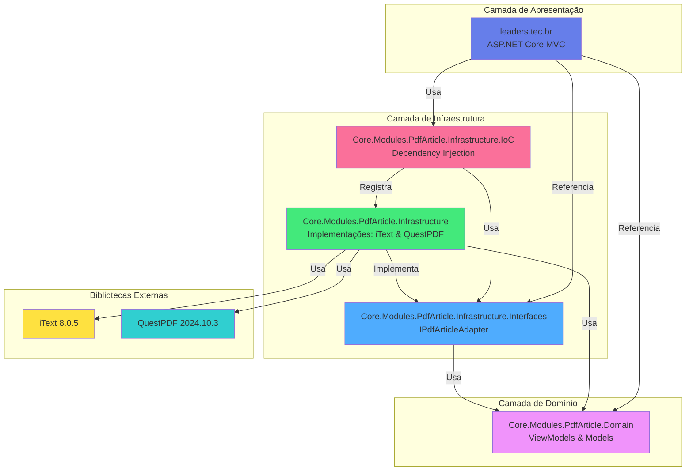

# leaders.tec.br - Plataforma de Geração de Artigos PDF

[](https://dotnet.microsoft.com/)
[](LICENSE)
[](https://github.com)

## 📖 Sobre o Projeto

Este é um projeto **open source** desenvolvido com a finalidade de **compartilhar conhecimento com a comunidade tech brasileira**. A plataforma `leaders.tec.br` oferece uma solução completa e modular para geração de artigos técnicos em formato PDF, utilizando uma arquitetura limpa e escalável baseada em .NET 8.

O objetivo principal é fornecer uma ferramenta gratuita e de código aberto para desenvolvedores, escritores técnicos e educadores que desejam criar documentos PDF de forma profissional e eficiente.

## 🎯 Funcionalidades

- ✅ Geração de artigos técnicos em PDF
- ✅ Interface web moderna e responsiva (ASP.NET Core MVC)
- ✅ Suporte a múltiplas bibliotecas de PDF (iText e QuestPDF)
- ✅ Arquitetura modular com injeção de dependências
- ✅ Formatação profissional de documentos
- ✅ Suporte a imagens, código-fonte e formatação especial
- ✅ Metadados customizáveis (autor, título, palavras-chave, etc.)

## 🏗️ Arquitetura da Solução



## 📁 Estrutura de Projetos

### 1. **leaders.tec.br** (Aplicação Web MVC)
Aplicação ASP.NET Core MVC que fornece a interface web para geração de PDFs.

### 2. **Core.Modules.PdfArticle.Domain**
Camada de domínio contendo os modelos e ViewModels utilizados em toda a solução.

### 3. **Core.Modules.PdfArticle.Infrastructure.Interfaces**
Define as interfaces (contratos) para os adaptadores de PDF.

### 4. **Core.Modules.PdfArticle.Infrastructure**
Implementações concretas dos adaptadores de PDF usando:
- **iText 8.0.5** - Biblioteca robusta para geração de PDFs
- **QuestPDF 2024.10.3** - Biblioteca moderna e fluente para PDFs

### 5. **Core.Modules.PdfArticle.Infrastructure.IoC**
Configuração de injeção de dependências para facilitar o uso dos módulos.

## 🚀 Como Executar

### Pré-requisitos
- [.NET 8.0 SDK](https://dotnet.microsoft.com/download/dotnet/8.0)
- IDE de sua preferência (Visual Studio, VS Code, Rider)

### Passos para executar

1. **Clone o repositório:**
```bash
git clone <url-do-repositorio>
cd Core.Modules.PdfArticle.Infrastructure
```

2. **Restaure as dependências:**
```bash
dotnet restore leaders.tec.br.sln
```

3. **Compile a solução:**
```bash
dotnet build leaders.tec.br.sln
```

4. **Execute a aplicação:**
```bash
dotnet run --project leaders.tec.br/leaders.tec.br.csproj
```

5. **Acesse no navegador:**
```
https://localhost:5001
```

## 🛠️ Tecnologias Utilizadas

- **Framework**: .NET 8.0
- **Web Framework**: ASP.NET Core MVC
- **Bibliotecas de PDF**: 
  - iText 8.0.5
  - QuestPDF 2024.10.3
- **Injeção de Dependências**: Microsoft.Extensions.DependencyInjection
- **Padrões**: Repository Pattern, Dependency Injection, Adapter Pattern

## 📝 Como Usar

### Exemplo de uso no código:

```csharp
// No seu controller ou serviço
public class PdfController : Controller
{
    private readonly IPdfArticleAdapter _pdfAdapter;

    public PdfController(IPdfArticleAdapter pdfAdapter)
    {
        _pdfAdapter = pdfAdapter;
    }

    public IActionResult Generate()
    {
        var articleModel = new PdfArticleViewModel
        {
            Title = "Meu Artigo",
            Author = "João Silva",
            Subject = "Tecnologia"
        };

        _pdfAdapter.OpenDocument(articleModel, "leaders.tec.br");
        _pdfAdapter.AddTitle("Título do Artigo");
        _pdfAdapter.AddBody("Conteúdo do artigo...");
        
        var pdfBytes = _pdfAdapter.Build();
        
        return File(pdfBytes, "application/pdf", "artigo.pdf");
    }
}
```

## 🤝 Contribuindo

Contribuições são sempre bem-vindas! Este é um projeto open source com o objetivo de compartilhar conhecimento. Sinta-se à vontade para:

1. Fazer um Fork do projeto
2. Criar uma branch para sua feature (`git checkout -b feature/MinhaFeature`)
3. Commit suas mudanças (`git commit -m 'Adiciona nova feature'`)
4. Push para a branch (`git push origin feature/MinhaFeature`)
5. Abrir um Pull Request

## 📄 Licença

Este projeto está sob a licença MIT. Veja o arquivo [LICENSE](LICENSE) para mais detalhes.

## 💡 Motivação

Este projeto foi criado com o objetivo de:
- 📚 Compartilhar conhecimento com a comunidade tech brasileira
- 🎓 Demonstrar boas práticas de arquitetura de software
- 🔧 Fornecer uma ferramenta útil e gratuita para a comunidade
- 🌟 Incentivar a colaboração e o aprendizado coletivo

## 👥 Comunidade

Junte-se à nossa comunidade de desenvolvedores! Compartilhe suas experiências, tire dúvidas e contribua para o crescimento do projeto.

---

**Desenvolvido com ❤️ para a comunidade tech brasileira**

*Se este projeto foi útil para você, considere dar uma ⭐ no repositório!*
